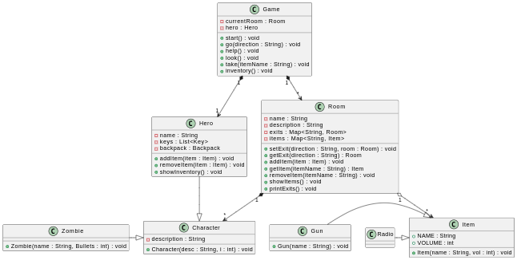

# Programmation Oriente Objet 1 : </br> Rapport du projet
Enseignant : Samuel Peltier

Composition du groupe : Saba Dzigua, Sebastian Lovejoy-Black, Antonin Spychala

# Sommaire 
1. [Description](#description)
2. [Structure des fichiers](#structure-des-fichiers)
3. [Execution](#execution)
4. [Diagramme UML](#diagramme-uml)
5. [Classes](#classes)
6. [Fonctionnalités non implémentées](#fonctionnalités-non-implémentées)

# Description
## Histoire
Lifeless est un jeu d'aventure textuel se déroulant dans un monde post-apocalyptique. Le jeu commence lorsque le personnage principal se réveille d'un coma dans un hôpital abandonné, découvrant un monde radicalement changé. L'objectif principal est de s'échapper de l'hôpital après avoir appelé à l'aide. Pour réussir, le joueur doit explorer l'hôpital pour trouver un radio, appeler à l'aide, récupérer une arme à feu ainsi que suffisamment de munitions pour survivre, et sauver un chirurgien qui possède un badge de sortie permettant de quitter les lieux. Le gameplay met l'accent sur l'exploration, la prise de décision et la résolution de problèmes, alors que le joueur navigue dans un environnement déserté et inconnu, rassemblant progressivement les éléments nécessaires pour avancer.

## Plan du jeu
<!-- insert map -->

# Structure des fichiers <!-- to be updated -->
```bash 
.
├── assets
│   └── lifeless_uml.png
├── bin
├── diagram.wsd
├── README.md
└── src
    └── game
        ├── Ammo.java
        ├── Backpack.java
        ├── Game.java
        ├── Gun.java
        ├── Hero.java
        ├── Item.java
        ├── Key.java
        ├── Main.java
        ├── NPC.java
        ├── Room.java
        └── Zombie.java
```
# Execution
<!-- will be known WHEN I GET THE FINISHED PRODUCT-->
# Diagramme UML


# Classes
## Package game
Toutes les classes présentes dans le package "game sont directement liées au jeu lui-même et à ses fonctionnalités.

### Game
La classe Game représente le cœur du jeu. Elle est chargée d'orchestrer les différentes mécaniques principales, comme la navigation entre les salles, l'interaction avec les objets, et l'affichage des informations au joueur. Elle est responsable de l'initialisation du jeu, la gestion de la boucle principale, les interactions avec le joueur, ainsi que la navigation et la positionnement.

La classe Game entretient une composition unidirectionnelle avec Hero et Room, car elle crée et gère directement leurs instances, et ces objets n'existent que dans le cadre du jeu.

#### Attributs
- currentRoom : La salle actuelle où se trouve le joueur.
- hero :  Le personnage du joueur, capable d'interagir avec le monde du jeu.

#### Constructeur 
Le constructeur Game() initialise toutes les salles, les connecte entre elles, et place des objets spécifiques dans certaines salles, et positionne le joueur dans la salle de départ (salle 301).

#### Méthodes
- start() : Lance le jeu
- go() : Déplace le joueur d'une salle à une autre
- help() : Affiche une liste des commandes disponibles
- look() : Affiche les objets présents dans la salle actuelle
- take() : Ramasse un objet dans la salle actuelle et le met dans l'inventaire du joueur
- inventory() : Montre les items que le joueur a récupéré

### Room
La classe Room représente une pièce ou un lieu dans le jeu. Elle gère les connexions avec d'autres pièces (sorties) et les items présents dans la salle.

La relation entre Room et Item est unidirectionnelle, car un objet de classe Item n'a aucune connaissance de la salle qui le contient. Elle s'apparente à une agrégation, car les objets Item peuvent exister indépendamment d'une salle.

#### Attributs 
- name : Le nom de la salle 
- description : Une description narrative de la salle 
- exits : Les sorties possibles depuis la salle. Les sorties, dans cette conception du jeu, ne sont pas modélisées comme des classes à part entière car il n'y a pas plusieurs types de sorties à gérer.
- items : Les items disponibles dans la salle

#### Constructeur
Le constructeur Room(String, String) initialise une nouvelle salle avec un nom et une description, et prépare les structures pour les sorties et les objets.

#### Méthodes
- getName() : Retourne le nom de la salle
- getDescription() : Retourne la description de la salle
- setExit() : Ajoute une sortie reliant la salle à une autre. 
- getExit() : Retourne la salle correspondante à une direction donnée.
- addItem() : Ajoute un objet à la salle.
- getItem() : Retourne un objet par son nom.
- removeItem() : Supprime un objet de la salle.
- showItems() : Affiche tous les objets présents dans la salle.

### Hero
La classe Hero représente le personnage contrôlé par le joueur. Elle gère son nom et son inventaire via un sac à dos (Backpack).

La relation entre Hero et Backpack est une composition unidirectionnelle, car le sac à dos est créé directement dans le constructeur du héros et ne connaît pas son propriétaire. Le sac à dos dépend entièrement de l'existence du Hero.

#### Attributs 
- name : name (String) : Le nom du héros (du joueur).
- backpack (Backpack) : Le sac à dos du héros, qui stocke les objets (Item).

#### Constructeur
Hero() initialise un héros avec un nom par défaut ("Generic"), et un sac à dos vide.

#### Méthodes
- getName(), getBackpack() : Accesseurs sur les attributs name et backpack.
- addItem() : Ajouter un objet dans le sac à dos.
- removeItem() : Retirer un objet du sac à dos.
- showInventory() : Afficher les objets présents dans le sac à dos.

### Item

La classe Item est une classe abstraite représentant un objet avec un nom (NAME) et un volume (VOLUME). Elle sert de base pour des objets spécifiques dans le jeu, mais ne peut pas être instanciée directement.

### Gun
La classe Gun étend la classe abstraite Item et représente une arme dans le jeu. Elle hérite des attributs NAME et VOLUME de Item, avec un volume fixe de 5 pour chaque instance de Gun. Le nom de l'arme est spécifié lors de sa création via le constructeur.

### NPC

La classe NPC est une classe abstraite représentant un personnage non-joueur dans le jeu. Elle possède un attribut description qui donne des informations sur le NPC. Le constructeur initialise cet attribut avec une description fournie, mais cette classe ne peut pas être instanciée directement, étant conçue pour être étendue par des classes spécifiques de NPC.

### Zombie

La classe Zombie étend la classe abstraite NPC et représente un type spécifique de personnage non-joueur dans le jeu. Elle hérite de l'attribut description de NPC, bien que son constructeur semble principalement destiné à initialiser un nom et un paramètre supplémentaire (probablement pour gérer les munitions, mais il n'est pas utilisé ici). Le Zombie est ainsi une spécialisation de NPC.

### Ammo

# Fonctionnalités non implémentées

## Plus de fins du jeu

Dans la version actuelle du jeu, il n'y a que deux façons de terminer le jeu : en mourant ou en accomplissant tous les objectifs nécessaires. Cependant, il aurait été intéressant d'ajouter quelques autres possibilités de fin, comme par exemple ce qui se passerait si le joueur décidait de quitter le bâtiment sans avoir appelé à l'aide. Ce type de choix pourrait offrir des fins alternatives et enrichir l'expérience de jeu en apportant plus de profondeur aux actions du joueur.

## Plus d'interactions

Une autre fonctionnalité qui aurait été intéressante à ajouter serait davantage d'interactions avec différents NPCs. Le jeu de base ne comporte que peu d'interactions avec les NPCs, y compris les zombies, et en ajoutant des histoires secondaires ou des dialogues enrichis avec ces personnages, cela aurait pu apporter plus de profondeur à l'univers du jeu et offrir une expérience plus immersive.

## Plus d'items

Dans la version actuelle du jeu, il n'y a que trois objets : le radio, l'arme à feu et les munitions. Cela est dû au fait que d'autres objets auraient dû être intégrés à l'intrigue que nous avons développée, mais nous n'avions pas d'idées supplémentaires à ce sujet. De plus, en raison des contraintes de temps, nous avons choisi de garder le jeu simple. Toutefois, l'ajout de nouveaux objets avec des capacités uniques serait un atout, car cela augmenterait les possibilités d'interaction du joueur avec l'environnement et enrichirait l'expérience de jeu.

## Un chronomètre

L'intégration d'un chronomètre n'a pas été jugée entièrement nécessaire, mais cela aurait pu être intéressant de l'introduire pour montrer combien de temps le joueur a avant de devoir quitter le bâtiment après avoir appelé à l'aide. Cela aurait créé un sentiment de suspense et donné au joueur une dernière chance de fouiller le bâtiment avant de partir.

